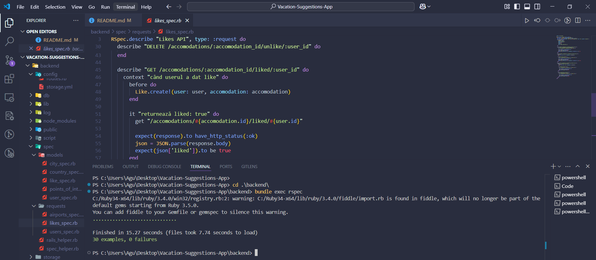

# Final Project Documentation

## 📌 Table of Contents

- [User Stories](#user-stories)
- [UML Diagrams](#uml-diagrams)
- [Source Control & Collaboration](#source-control--collaboration)
- [Automated Testing](#automated-testing)
- [Bug Reporting & Resolution](#bug-reporting--resolution)
- [Coding Standards](#coding-standards)
- [Design Patterns](#design-patterns)
- [Prompt Engineering](#prompt-engineering)

---

## ✅ User Stories

Here are the user stories implemented in the application:

| ID   | As a...    | I want to...                                                  | So that...                                                         |
| ---- | ---------- | ------------------------------------------------------------- | ------------------------------------------------------------------ |
| 1    | Guest      | Create an account                                             | I can use the website with all its features                        |
| 2    | Guest      | See benefits of creating an account                           | I am motivated to sign up                                          |
| 3    | Visitor    | Enable dark mode                                              | I have a comfortable browsing experience                           |
| 4    | User       | Filter vacation recommendations                               | I can refine my search                                             |
| 5    | User       | View hotels in different countries and cities                 | I can explore accommodation options based on my travel destination |
| 6    | User       | Log in and log out securely                                   | I can access my saved preferences                                  |
| 7    | User       | Switch the chatbot’s language                                 | I can interact in my preferred language                            |
| 8    | User       | Receive suggestions from the chatbot                          | I can find the perfect vacation spot                               |
| 9    | Visitor    | View an interactive map with points of interest               | I can easily discover attractions and restaurants nearby           |
| 10   | User       | Receive recommendations based on my previous likes            | I can discover places that match my preferences                    |
| 11   | User       | Save my favorite destinations                                 | I can easily find them later                                       |
| 12   | Visitor    | View the flying routes from my city to different destinations | I can plan how to reach my desired location                        |

## 🧩 UML Diagrams

The following UML diagrams were created to better understand and design the architecture:

1. **Workflow Diagram** - Represents user interactions such as searching hotels, talking to the chatbot or looking for POIs.
2. **Use Case Diagram** – Represents the main functionalities of the website and how different types of users interact with them.

_All diagrams are included in the `/diagrams` folder._

---

## 🔀 Source Control & Collaboration

- Git was used as the primary version control system.
- All development was done in **feature branches**.
- Pull Requests (PRs) were used for merging into the `main` branch.
- Code reviews were conducted before merging each PR.
- Meaningful commit messages and tags were used for tracking.

---

## 🧪 Automated Testing

**RSpec** was used as the main testing framework.

Tests include:

- **Model validation tests** for `User`, `City`, `Country`, and `PointsOfInterest`
- **Request specs** for all CRUD endpoints (`/countries`, `/cities`, `/airports`)
- Tests include both valid and invalid scenarios (e.g., missing required fields)

To run all tests:

```bash
bundle exec rspec
```



## 🧑‍💻 Coding Standards

In this project, Ruby on Rails coding conventions and best practices have been strictly followed to ensure clean, maintainable, and readable code. Some specific standards and practices include:

- **Controller Code Style:**

  - Use of meaningful method names (`create`, `google`) following RESTful conventions.
  - Clear separation of concerns: controller handles request/response logic, model handles data.
  - Proper error handling with `rescue` blocks for external service validation (e.g., Google OAuth).
  - Use of private methods (`encode_jwt`) to encapsulate helper logic inside controllers.
  - Comments added for clarity, especially for key operations like authentication and token encoding.

- **Example from `SessionsController`:**

```ruby
class SessionsController < ApplicationController
  require 'google-id-token'

  # POST /sessions
  def create
    # Cautam utilizatorul in functie de email
    @user = User.find_by(email: params[:email])

    if @user && @user.authenticate(params[:password])  # Verifică dacă parola este corectă
      # Dacă autentificarea este reușită, generăm un token JWT pentru utilizator
      token = encode_jwt(@user)
      render json: { token: token, message: 'Login successful', user: @user }, status: :ok
    else
      render json: { message: 'Invalid email or password' }, status: :unauthorized
    end
  end

  # POST /sessions/google
  def google
    begin
      validator = GoogleIDToken::Validator.new
      payload = validator.check(params[:credential], ENV['GOOGLE_CLIENT_ID'])

      # Extract user information from the payload
      email = payload['email']
      name = payload['name']

      # Find or create user
      @user = User.find_by(email: email)

      if @user.nil?
        # Create a new user with a random password
        random_password = SecureRandom.hex(10)
        @user = User.create!(
          email: email,
          nume: name,
          password: random_password
        )
      end

      # Generate JWT token
      token = encode_jwt(@user)

      render json: {
        token: token,
        message: 'Google authentication successful',
        user: @user
      }, status: :ok

    rescue GoogleIDToken::ValidationError => e
      render json: { message: 'Google authentication failed', error: e.message }, status: :unauthorized
    rescue => e
      render json: { message: 'Google authentication failed', error: e.message }, status: :unauthorized
    end
  end

  private

  # Metodă pentru a genera un token JWT
  def encode_jwt(user)
    payload = { user_id: user.id }
    JWT.encode(payload, Rails.application.secret_key_base)
  end
end
```

## 💡 Prompt Engineering

Throughout the development process, various Large Language Models (LLMs) were utilized to enhance productivity, improve understanding of complex concepts, and support efficient implementation. Each LLM contributed differently depending on the stage of development and the type of task.

### 🛠️ Tools Used

#### 🧠 GPT-4.1 (OpenAI)

- Used extensively via ChatGPT.
- Primary assistant for:
  - Writing RSpec tests and debugging validation errors.
  - Explaining ActiveRecord associations and migrations.
  - Refactoring code following Ruby on Rails best practices.
- Especially effective for:
  - Resolving obscure Rails errors.
  - Suggesting clean architectural solutions (e.g., service objects, validations).
  - Writing expressive, idiomatic Ruby.

#### 🧠 Claude Sonnet (Anthropic)

- The latest Claude model was used for high-level code reviews and general-purpose reasoning.
- Helped:
  - Break down architectural questions.
  - Explore alternative approaches to validations and model design.
  - Summarize complex logic or test errors.

#### 🧠 Grok (X AI)

- Used mainly out of curiosity during testing and prompt generation phases.
- Effective for:
  - Brainstorming edge-case scenarios.
  - Suggesting realistic test data for request specs.
  - Providing variant explanations for similar prompts, especially helpful during debugging.

---

### 🎯 Use Cases for Prompt Engineering

| Purpose                      | LLM Used        | Example Tasks                                                         |
| ---------------------------- | --------------- | --------------------------------------------------------------------- |
| Writing RSpec tests          | GPT-4.1         | Generated test suites for `User`, `Airport`, and `POI` models         |
| Understanding ActiveRecord   | GPT-4.1, Claude | Clarified how `belongs_to` impacts `validates_presence_of`            |
| Generating model validations | GPT-4.1         | Drafted standard Rails validations and associations                   |
| Refactoring controllers      | Claude Sonnet   | Suggested ways to extract logic into service objects                  |
| Prompt testing/variation     | Grok            | Created prompt variants for API error simulations and test generation |
| Learning comparisons         | Claude, GPT-4.1 | Compared different LLM outputs for model-based solutions              |

---

### 🤖 Reflection

Prompt engineering proved critical for:

- Accelerating the development of test cases and boilerplate code.
- Offering just-in-time learning while solving Rails-specific bugs.
- Comparing LLMs increased output reliability and helped avoid hallucinations or inaccuracies.
- Combining multiple models often led to the most accurate and useful results.

This multi-agent approach significantly reduced the time required to develop, test, and debug core features of the Rails application.

---

```

```
